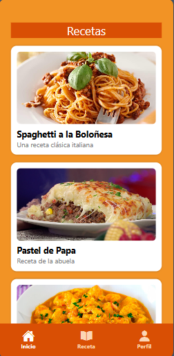
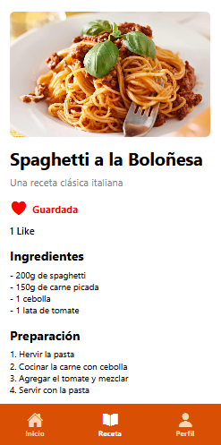
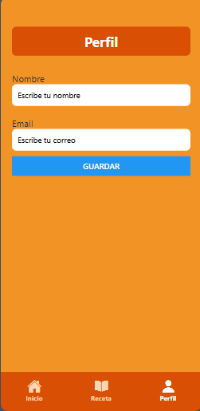

# 📱 RecetApp

Aplicación mobile de **recetas** desarrollada como proyecto de práctica con **React Native** en el CFL 404.  
La app permite explorar recetas cargadas, darles like y gestionar un perfil de usuario, con una interfaz simple y visualmente agradable.

---

## ✨ Funcionalidades

- 📖 Listado de recetas precargadas  
- ❤️ Sistema de likes para recetas favoritas  
- 👤 Perfil de usuario  
- 📱 Diseño mobile-first  
- ⚡ Navegación fluida entre pantallas  

---

## 🛠️ Tecnologías utilizadas

- ⚛️ **React Native**
- 📦 **Expo**
- 🧭 **React Navigation**
- 🎨 **StyleSheet / UI personalizada**
- 🗂️ Manejo de estado local

---

## 📸 Screenshots

> Algunas capturas de la aplicación en funcionamiento:

  
  
  

git
